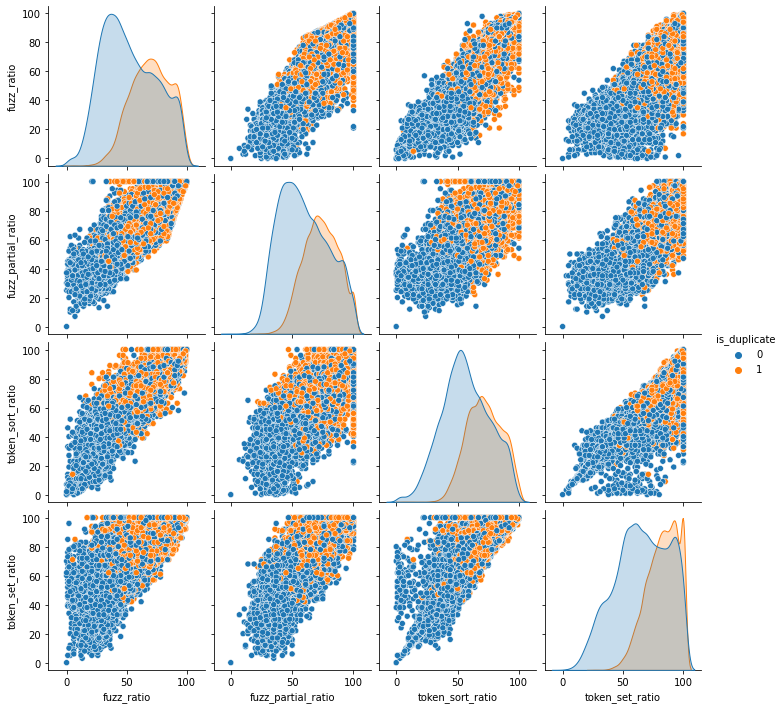

# Similar-Dublicate_questions_Detection_On_Quora

# **Problem Statement**
Identify which questions asked on Quora are duplicates of questions that have already been asked.This could be useful to instantly provide answers to questions that have already been answered.We are tasked with predicting whether a pair of questions are duplicates or not.

---

# **Prerocessing** 

* Regular Expression 
* Removing html tags
* Removing Punctuations
* Performing stemming
* Removing Stopwords
* Expanding contractions etc.
---

# **Fuzzy String matching Features**

  

# **Methodlgy**

* Used Hand-craft Featurs and Fuzzy String matching based features 
* TF-IDF word Embedding and Weighted TF-IDF Glove(Word2vec) vectorization
* ML Model -> SVM and Logistic Regression with Hyparparameter Tuning.

  

---

# **Results**
* Performance by using TF-IDF
* Performance by Using TF-IDF weighted Glove(W2Vec)

---
**Weighter TF-IDF w2v**

|       ML Model      | Vectorizer | Train log loss | Test log loss | Accuracy | Precision | recall | f1-score |
|---------------------|------------|----------------|---------------|----------|-----------|--------|----------|
| Logistic Regression | TF-IDF w2v |     0.385      |     0.3942    |   0.81   |    0.80   |  0.78  |   0.79   |
|      Linear SVM     | TF-IDF w2v |     0.387      |     0.395     |   0.81   |    0.81   |  0.78  |   0.79   |

---

 **TF-IDF vec**
 

|       ML Model      | Vectorizer | Train log loss | Test log loss | Accuracy | Precision | recall | f1-score |
|---------------------|------------|----------------|---------------|----------|-----------|--------|----------|
| Logistic Regression |  TF-IDF    |     0.436      |     0.539     |   0.74   |    0.72   |  0.69  |   0.70   |
|      Linear SVM     |  TF-IDF    |     0.488      |     0.544     |   0.74   |    0.73   |  0.69  |   0.69   |

